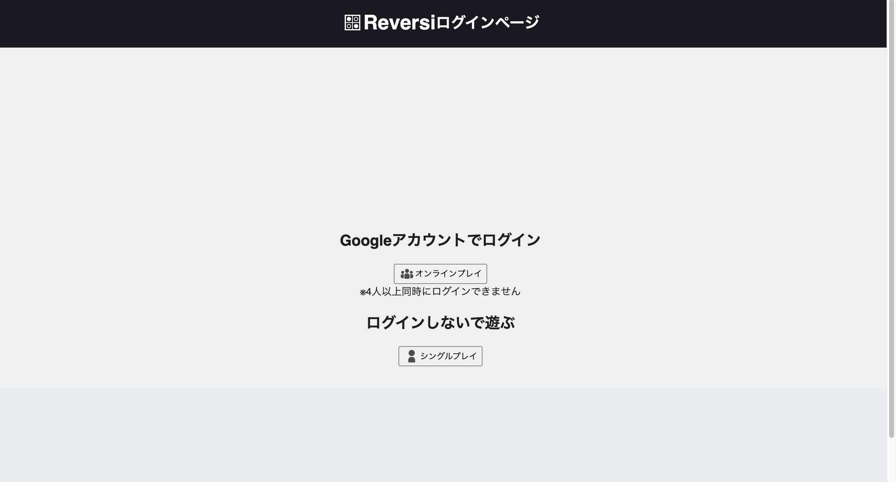

# 3人用リバーシ

## 概要

赤，青，白の3色の駒と96個の三角形のマスを持った六角形の盤面を使って，3人でプレイできるリバーシ．

https://test-b1eea.firebaseapp.com

## ルール

- 赤，青，白の順で盤面に駒を置いていく．
- 同一直線を底辺とする三角形に着目し，同じ色の駒で挟めば，挟まれた駒は自分の色に変化する．

- 置ける場所がなければ，自分の番をスキップする．
- 全員置ける場所がなければ試合終了．
- 試合終了時，盤面に自分の色の駒が最も多くあるプレイヤーが勝利となる．

上の図では赤34個，青31個，白31個なので赤の勝ち．

## 手順

1. オンラインプレイ(ログイン)かシングルプレイか選択．

2. 色が明るくなっていマスをクリック．
3. 試合が終了すると結果が表示される．

4. もう一度プレイする場合盤面を初期化する．

### 参考

- RIVER SEA GROUND

    概要: 六角形の盤面と三角形の駒を使った2人用リバーシ．(WOOD LABO IKEDAとSukima.(CENSA.INC)のコラボ商品)
https://censa.jp/c/riverseaground/

    ルール: https://censa.jp/c/riverseaground/download/riverseaground.rulebook.3.2.pdf

- 六角オセロ(ドラゴンリバーシ)

    概要: 91個の六角形を繋げてできた盤面と3色の駒を使った3人用リバーシ．(開発者: 山之内洋一)
https://joe.sbody.info/%E5%85%AD%E8%A7%92%E3%82%AA%E3%82%BB%E3%83%AD/

- Triversi(トリバーシ)

    概要: 38個の点が描かれた盤面と赤，青，黄の駒を使った3人用リバーシ．(株式会社クリエイティブハウスキューズの商品)
https://gamemarket.jp/game/180597

icon: https://icooon-mono.com/
