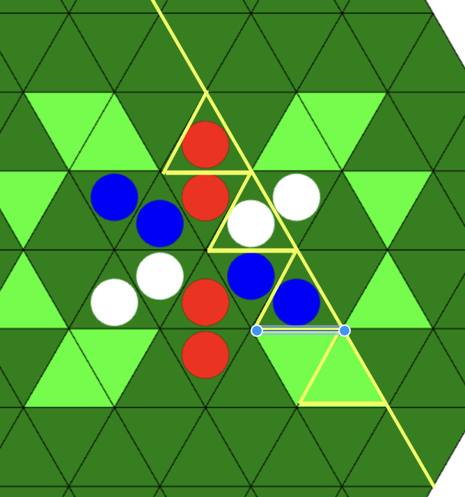
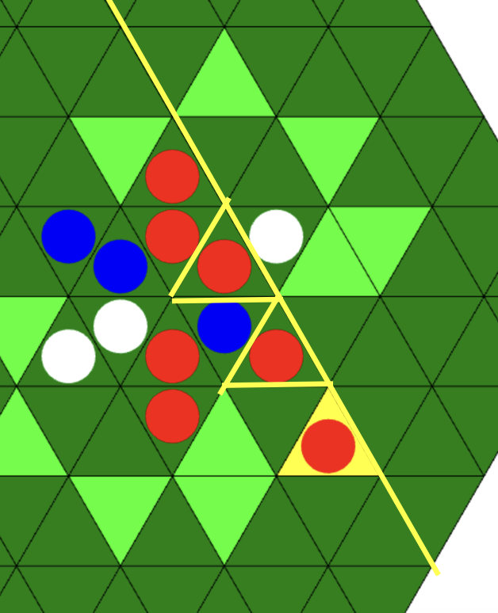
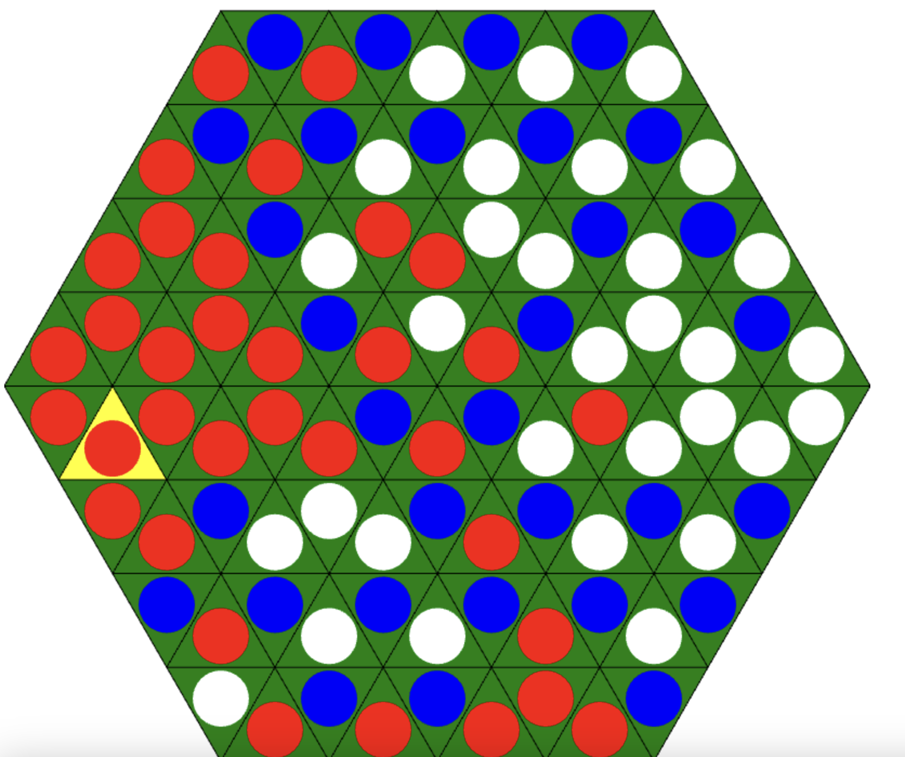
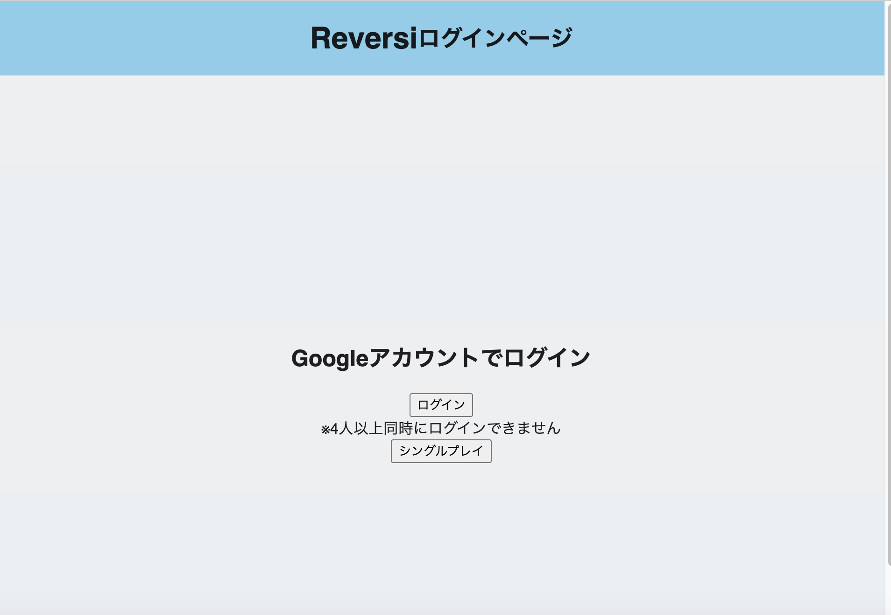
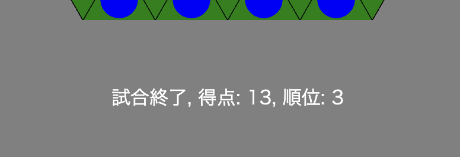

# ルール

- 赤，青，白の順で盤面に駒を置いていく．
- 同一直線を底辺とする三角形に着目し，同じ色の駒で挟めば，挟まれた駒は自分の色に変化する．

- 置ける場所がなければ，自分の番をスキップする．
- 全員置ける場所がなければ試合終了．
- 試合終了時，盤面に自分の色の駒が最も多くあるプレイヤーが勝利となる．

上の図では赤34個，青31個，白31個なので赤の勝ち．

## 手順

1. オンラインプレイ(ログイン)かシングルプレイか選択．

2. 色が明るくなっていマスをクリック．
3. 試合が終了すると結果が表示される．

4. 終了ボタンを押してログインページに戻る．
